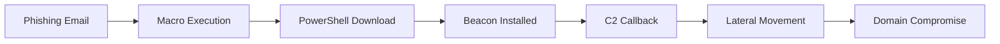
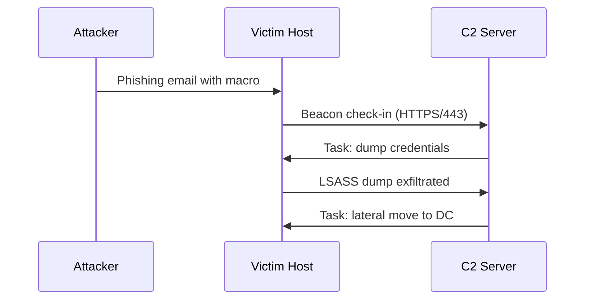
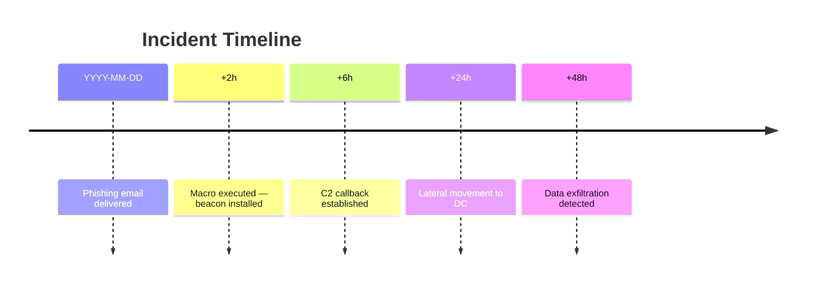
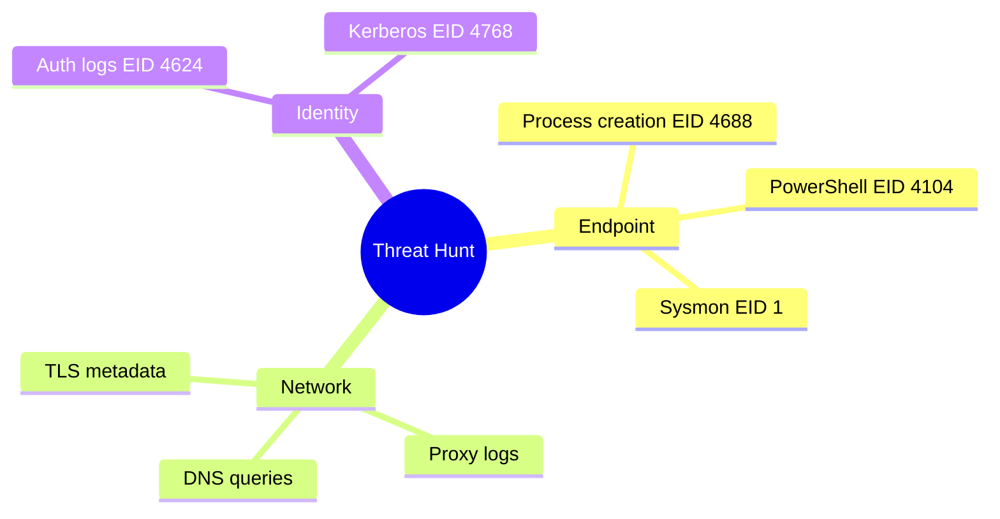

# [Post Title] — MkDocs Material Feature Reference

This post serves as a living reference for every MkDocs Material feature available when writing
blog posts. Copy this file, replace the placeholder content, and remove anything you don't need.

<!-- more -->

---

## Admonitions

All built-in admonition types — use the one that fits the message:

!!! note "Note"
    General information. Use when adding context that isn't a warning.

!!! tip "Tip"
    Best practices and actionable shortcuts.

!!! info "Info"
    Supplementary detail that enriches but isn't essential.

!!! warning "Warning"
    Potential pitfall or configuration mistake to watch out for.

!!! danger "Danger"
    Critical warning — data loss, irreversible action, or security risk.

!!! success "Success"
    Positive outcome or a confirmed working result.

!!! failure "Failure"
    What went wrong and why.

!!! bug "Bug"
    Confirmed defect or unexpected behavior.

!!! question "Question / FAQ"
    Rhetorical prompts or FAQ items.

!!! quote ""
    Pull quote or notable excerpt. Empty string removes the title bar entirely.

!!! example "Example"
    Concrete demonstration of a concept.

!!! abstract "Abstract / TL;DR"
    Summary at the top of long posts — give the reader the gist upfront.

### Collapsible Admonitions

??? tip "Click to expand (collapsed by default)"
    Use `???` for collapsed. Use `???+` for expanded by default.

???+ warning "Expanded by default"
    This opens automatically on page load.

---

## Code Blocks

### Basic fenced block

```python
def hunt(log_source: str) -> list[str]:
    hits = []
    # parse and analyze
    return hits
```

### With title and line highlighting

```powershell title="Detect encoded PowerShell" hl_lines="2 3"
# Search Windows Event Logs for base64 encoded commands
Get-WinEvent -LogName Security |
  Where-Object { $_.Message -match '-[Ee]nc' } |
  Select-Object TimeCreated, Message
```

### With line numbers

```python linenums="1"
import hashlib

def ja3_fingerprint(client_hello: bytes) -> str:
    return hashlib.md5(client_hello).hexdigest()
```

### Inline code

Use `backticks` for inline code. The theme applies syntax color automatically.
Reference tool names like `mimikatz`, paths like `C:\Windows\System32\lsass.exe`,
and flags like `--no-verify`.

### Annotations inside code (1)

```bash
curl -X POST https://api.example.com/ingest \  # (1)!
  -H "Authorization: Bearer $TOKEN" \
  -d '{"event": "process_create"}'
```

1.  Replace with your actual API endpoint. Keep the token in an environment variable.

---

## Content Tabs

Use tabs to show platform-specific commands, language variants, or tool alternatives:

=== "Windows"
    ```powershell
    Get-WinEvent -LogName Security -MaxEvents 100 |
      Where-Object { $_.Id -eq 4624 }
    ```

=== "Linux"
    ```bash
    journalctl -u sshd --since "2025-01-01" | grep "Accepted"
    ```

=== "macOS"
    ```bash
    log show --predicate 'process == "sshd"' --last 1d
    ```

=== "Cloud (Azure)"
    ```kusto
    SigninLogs
    | where TimeGenerated > ago(1d)
    | where ResultType == 0
    | project TimeGenerated, UserPrincipalName, IPAddress, Location
    ```

---

## Tables

Standard table with alignment:

| Technique | ATT&CK ID | Tactic | Detection Difficulty |
|-----------|:---------:|--------|:--------------------:|
| PowerShell | T1059.001 | Execution | Medium |
| LSASS Dump | T1003.001 | Credential Access | High |
| DNS Tunneling | T1071.004 | C2 | Hard |
| Scheduled Task | T1053.005 | Persistence | Easy |

---

## Task Lists

- [x] Enumerate live hosts
- [x] Identify exposed services
- [ ] Exploit vulnerability
- [ ] Establish persistence
- [ ] Exfiltrate data

---

## Definition Lists

Cobalt Strike
:   Commercial adversary simulation framework; heavily abused by threat actors for post-exploitation.

Beacon
:   The C2 implant used by Cobalt Strike. Communicates via HTTP, HTTPS, SMB, or DNS.

JARM
:   Active TLS fingerprinting tool that identifies C2 infrastructure by their TLS handshake pattern.

SIGMA
:   Generic rule format for SIEM-agnostic detection logic. Converts to SPL, KQL, EQL, and more.

---

## Keyboard Keys

Press ++ctrl+alt+t++ to open a terminal.
Use ++ctrl+c++ to copy, ++ctrl+v++ to paste.
++win+r++ → type `eventvwr.msc` to open Event Viewer.
++f5++ refreshes, ++ctrl+shift+i++ opens DevTools.

---

## Footnotes

Cobalt Strike was first released in 2012[^1] and remains the most detected C2 framework
in enterprise environments[^2].

[^1]: Raphael Mudge, "Cobalt Strike," Strategic Cyber LLC, 2012.
[^2]: Red Canary Threat Detection Report, 2024.

---

## Text Formatting

Use ==highlighted text== to mark critical terms or findings.

~~Strikethrough~~ for deprecated commands or removed indicators.

Subscript: H~2~O · Superscript: 2^10^ = 1024

> Blockquotes work for notable quotes or sourced statements.
>
> — Attribution here

---

## Mermaid Diagrams

### Attack Chain Flowchart



### ATT&CK Sequence Diagram



### Timeline Diagram



### Mind Map



---

## Grid Cards

<div class="grid cards" markdown>

-   :material-shield-bug: **Initial Access**

    ---

    Phishing · Supply chain · Exposed services

    Covers T1566, T1190, T1195 and related techniques.

    [:octicons-arrow-right-24: ATT&CK TA0001](https://attack.mitre.org/tactics/TA0001/)

-   :material-radar: **Persistence**

    ---

    Scheduled tasks · Registry run keys · Services · Startup folders

    Covers T1053, T1547, T1543 and related techniques.

    [:octicons-arrow-right-24: ATT&CK TA0003](https://attack.mitre.org/tactics/TA0003/)

-   :material-eye-outline: **Detection Resources**

    ---

    Sigma rules · KQL · SPL · EQL — all in one place.

    [:octicons-arrow-right-24: Sigma HQ](https://github.com/SigmaHQ/sigma)

-   :material-book-open-page-variant: **Threat Intel**

    ---

    CTI reports, IOC feeds, and adversary profiles from trusted sources.

    [:octicons-arrow-right-24: MITRE ATT&CK](https://attack.mitre.org/)

</div>

---

## Icons & Emoji

Inline icons from Material, Font Awesome, and Octicons:

:material-shield-lock: :material-target: :material-radar: :fontawesome-brands-github:
:fontawesome-brands-linux: :octicons-terminal-24: :material-eye: :material-key:
:material-lock: :material-alert: :material-check-circle: :material-close-circle:

Browse all icons: [squidfunk.github.io/mkdocs-material/reference/icons-emojis](https://squidfunk.github.io/mkdocs-material/reference/icons-emojis/)

---

## Images

Standard image with relative path (works in `docs/blog/posts/`):

```markdown

```

Image with caption using `md_in_html`:

```markdown
<figure markdown>
  
  <figcaption>LSASS memory regions visible in Process Hacker 3.0</figcaption>
</figure>
```

Image with alignment attribute:

```markdown
{ align=right width=120 }
```

---

## Tooltips / Abbreviations

Abbreviations defined anywhere in the file render as tooltips on hover.
Add them as a block at the end of your post (or in a shared file via snippets):

```markdown
The SIEM detected a C2 callback over DNS.

*[SIEM]: Security Information and Event Management
*[C2]: Command and Control
*[DNS]: Domain Name System
```

---

## Details / Collapsible Sections

Use `details` for long content that clutters the page when expanded by default:

??? example "Full Sigma rule (click to expand)"
    ```yaml
    title: Suspicious Scheduled Task Creation
    id: 00000000-0000-0000-0000-000000000000
    status: experimental
    logsource:
      product: windows
      category: process_creation
    detection:
      selection:
        Image|endswith: '\schtasks.exe'
        CommandLine|contains: '/create'
      condition: selection
    level: medium
    ```

---

## Frontmatter Reference

Copy this block to start any new blog post:

```yaml
---
date: YYYY-MM-DD                   # Required: publication date
authors:
  - n1ghtfury                      # Must match key in blog/.authors.yml
tags:                              # Free-form tags for filtering
  - Tag One
  - Tag Two
categories:                        # One of: Detection Engineering, DFIR & Threat Hunting,
  - Category Name                  # Adversary Emulation, MISC
description: >                     # Optional: custom excerpt for SEO (overrides auto-excerpt)
  One or two sentence custom description for search engines and social cards.
draft: true                        # Remove this line to publish the post
---
```

Use `<!-- more -->` after the first paragraph to mark where the blog index excerpt ends.

---

## References

- [MkDocs Material — Reference](https://squidfunk.github.io/mkdocs-material/reference/)
- [PyMdown Extensions](https://facelessuser.github.io/pymdown-extensions/)
- [MITRE ATT&CK](https://attack.mitre.org/)

*[SIEM]: Security Information and Event Management
*[C2]: Command and Control
*[EDR]: Endpoint Detection and Response
*[TTPs]: Tactics, Techniques, and Procedures
*[IOC]: Indicator of Compromise
*[LSASS]: Local Security Authority Subsystem Service
