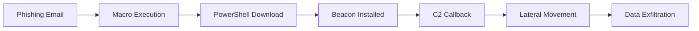
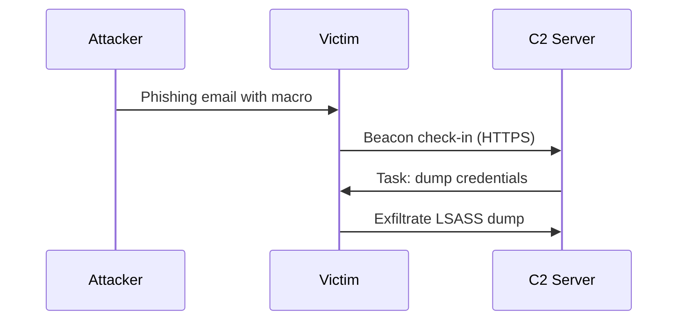

# Blog Post Template — MkDocs Material Feature Reference

This file is a **draft template** — it won't appear in the published blog. Copy it to create
new posts. Remove `draft: true` from the frontmatter when ready to publish.

<!-- more -->

## Frontmatter Reference

```yaml
---
date: YYYY-MM-DD                      # Required: publication date
authors:
  - n1ghtfury                         # Must match key in blog/.authors.yml
tags:                                 # Free-form tags (any string)
  - Tag One
  - Tag Two
categories:                           # Broader grouping
  - Category Name
description: >                        # Overrides auto-excerpt for SEO meta
  One or two sentence custom description.
draft: true                           # Remove this line to publish
---
```

Use `<!-- more -->` to mark where the excerpt ends on the blog index page.

---

## Admonitions

All built-in types:

!!! note "Note"
    Use for general information.

!!! tip "Tip"
    Use for helpful advice and best practices.

!!! info "Info"
    Use for supplementary context.

!!! warning "Warning"
    Use for potential pitfalls.

!!! danger "Danger"
    Use for critical warnings — data loss, irreversible actions.

!!! success "Success"
    Use to highlight a positive outcome.

!!! failure "Failure"
    Use to highlight what went wrong.

!!! question "Question"
    Use for FAQs or rhetorical prompts.

!!! quote ""
    Use for pull quotes or notable excerpts. Empty string removes the title bar.

!!! example "Example"
    Use for concrete demonstrations.

!!! abstract "Abstract / TL;DR"
    Use for summaries at the top of long posts.

!!! bug "Bug"
    Use when documenting a confirmed bug.

### Collapsible (Details)

??? tip "Click to expand"
    Content hidden by default. Use `???+` to expand by default.

???+ warning "Expanded by default"
    This one opens automatically.

---

## Code Blocks

### Basic fenced block

```python
def hunt_cobalt_strike(pcap_file: str) -> list[str]:
    """Return list of suspected C2 IPs from a packet capture."""
    hits = []
    # ... analysis logic
    return hits
```

### With title and line highlighting

```powershell title="Detect encoded PowerShell" hl_lines="2 3"
# Look for encoded commands in Windows Event Logs
Get-WinEvent -LogName Microsoft-Windows-PowerShell/Operational |
  Where-Object { $_.Message -match '-[Ee]nc' } |
  Select-Object TimeCreated, Message
```

### With line numbers

```python linenums="1"
import hashlib

def ja3_hash(client_hello: bytes) -> str:
    return hashlib.md5(client_hello).hexdigest()
```

### Inline code

Use `backticks` for inline code. The color adapts to the theme.

---

## Content Tabs

=== "Windows"
    ```cmd
    net user /domain
    ```

=== "Linux"
    ```bash
    getent passwd | awk -F: '$3 >= 1000'
    ```

=== "macOS"
    ```bash
    dscl . list /Users | grep -v '^_'
    ```

---

## Tables

| Technique        | ATT&CK ID | Tactic        | Detection Difficulty |
|------------------|-----------|---------------|:--------------------:|
| PowerShell       | T1059.001 | Execution     | Medium               |
| LSASS Dump       | T1003.001 | Credential    | High                 |
| DNS Tunneling    | T1071.004 | C2            | Hard                 |
| Scheduled Task   | T1053.005 | Persistence   | Easy                 |

---

## Task Lists

- [x] Enumerate live hosts
- [x] Identify services
- [ ] Exploit vulnerability
- [ ] Establish persistence
- [ ] Exfiltrate data

---

## Definition Lists

Cobalt Strike
:   A commercial adversary simulation framework abused by threat actors for post-exploitation operations.

Beacon
:   The implant payload used by Cobalt Strike for C2 communication.

JARM
:   A TLS fingerprinting tool that actively probes servers and identifies C2 infrastructure by their TLS response patterns.

---

## Keyboard Keys

Press ++ctrl+alt+t++ to open a terminal.
Use ++ctrl+c++ to copy, ++ctrl+v++ to paste.
++win+r++ then type `cmd` to open Command Prompt.

---

## Footnotes

Cobalt Strike was first released in 2012[^1] and has since become the most detected C2 framework
in enterprise environments[^2].

[^1]: Raphael Mudge, "Cobalt Strike," Strategic Cyber LLC, 2012.
[^2]: Various threat intelligence reports, 2023–2024.

---

## Text Highlighting & Critic Markup

Use ==highlighted text== to mark important terms.

---

## Mermaid Diagrams

### Attack chain flowchart



### ATT&CK sequence diagram



---

## Grid Cards

<div class="grid cards" markdown>

-   :material-shield-bug: **Card Title**

    ---

    Card description text. Can include **bold**, *italic*, and `code`.

    [:octicons-arrow-right-24: Link text](https://example.com)

-   :material-radar: **Another Card**

    ---

    Second card content. Use icons from Material Icons or Font Awesome.

    [:octicons-arrow-right-24: Link text](https://example.com)

</div>

---

## Emoji & Icons

In-line emoji: :material-shield-lock: :fontawesome-brands-github: :octicons-terminal-24:

Browse all icons at [Material Icons](https://squidfunk.github.io/mkdocs-material/reference/icons-emojis/).

---

## Blockquotes

> The best defense is understanding the offense.
> 
> — N1ghtFury

---

## Images

Standard image (path relative to this post file):

```markdown

```

Image with caption:

```markdown
<figure markdown>
  
  <figcaption>Caption text here</figcaption>
</figure>
```

---

## References

- [MkDocs Material Reference](https://squidfunk.github.io/mkdocs-material/reference/)
- [PyMdown Extensions](https://facelessuser.github.io/pymdown-extensions/)
- [MITRE ATT&CK](https://attack.mitre.org/)
