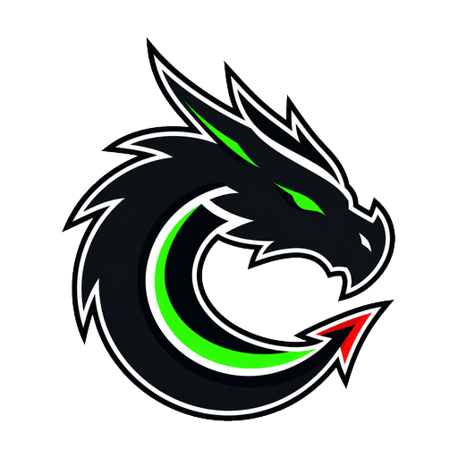

---
hide:
  - toc
  - navigation
---

  

    
  

  <h1 class="nf-hero__title">N1ghtFury</h1>
  
Explore the hidden world in Threat landscape.

  
Threat Hunting &nbsp;&middot;&nbsp; Detection Engineering &nbsp;&middot;&nbsp; Adversary Emulation &nbsp;&middot;&nbsp; DFIR

  

    <a href="blog/" class="nf-btn nf-btn--primary">Read the Blog</a>
    <a href="about/" class="nf-btn nf-btn--secondary">About Me</a>
  

## Recent Posts { #recent-posts .nf-section__title }

-   :material-target: **Threat Hunting**

    ---

    *Hunt operations &nbsp;·&nbsp; Hypothesis-driven &nbsp;·&nbsp; Anomaly detection*

    Structured hunting methodologies across endpoint, network, and identity telemetry —
    from hypothesis formation to validated findings and playbook updates.

    [:octicons-arrow-right-24: View posts](blog/index.md)

-   :material-shield-check: **Detection Engineering**

    ---

    *Analytics &nbsp;·&nbsp; SIEM/EDR &nbsp;·&nbsp; ATT&CK coverage*

    Building high-signal detections, tuning false positives, and mapping coverage
    to MITRE ATT&CK. From use-case design to Sigma rules and validation.

    [:octicons-arrow-right-24: View posts](blog/index.md)

-   :material-magnify-scan: **DFIR & Adversary Emulation**

    ---

    *Forensics &nbsp;·&nbsp; Incident response &nbsp;·&nbsp; Attack simulation*

    Incident analysis, attack timeline reconstruction, and controlled adversary
    emulation to validate defenses and close visibility gaps.

    [:octicons-arrow-right-24: View posts](blog/index.md)

[View all posts :octicons-arrow-right-24:](blog/index.md){ .nf-btn .nf-btn--secondary }

## What This Blog Is { .nf-section__title }

N1ghtFury is a knowledge hub where I explore security research and
defensive strategies. While my roots are in threat research, DFIR, adversary emulation, and
detection engineering, this blog covers a wide spectrum of topics with no limitations — from
emerging threats and defensive innovations to security tools, operational tactics, and
everything in between.

  Threat Research
  Detection Engineering
  DFIR &amp; Forensics
  Adversary Emulation
  Threat Intelligence
  Malware Analysis
  Security Tools &amp; Tactics

## Why "N1ghtFury"? { .nf-section__title }

!!! quote ""
    In *How to Train Your Dragon*, Toothless the Night Fury is the most feared and most
    misunderstood dragon. Feared for its destructive power, yet capable of forming the
    strongest bonds with those who truly understand it.

Similarly, in cybersecurity, the most dangerous threats are those we misunderstand. This
blog is about understanding adversaries — their tactics, techniques, and procedures — so
we can defend against them effectively. We honor the complexity, respect the power, and
build the knowledge to coexist with threats in the digital world.

[Meet Mohamed Hany :octicons-arrow-right-24:](about/){ .nf-btn .nf-btn--secondary }

